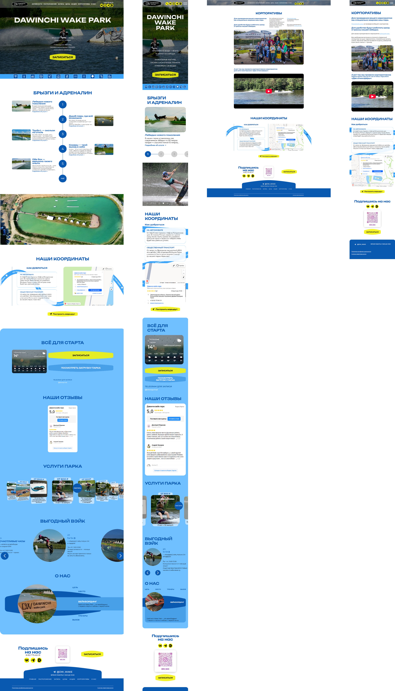

# $\color{turquoise}\textsf{DAWINCHI wake park}$

$\color{red}\text{Заказ с фриланс-биржи		}$

## $\color{mediumblue}\text{Описание работы }$:

Внешняя часть сайта (вёрстка).

<u>**Основное техническое задание и требования</u>** :

📌 Технологии: HTML5, CSS3 (возможно, частично JavaScript для интерактива).

📌 Адаптивность: Обязательна (десктоп, планшет, мобильный)

📌 Кроссбраузерность: Chrome, Safari, Firefox, Edge

📌 Оптимизация изображений и стилей, без лишних библиотек

📌 Семантическая верстка: Использование тегов section, header, footer, article и прочее.

📌 Валидация: Код должен проходить W3C Validator

📌 Шрифты: Использовать те, что указаны в Figma (Google Fonts или подключение локально)

🎯 $\color{mediumblue}\textsf{Основная задача}$ - Создание кроссбраузерного, адаптивного сайта на чистом HTML+CSS (без CMS и фреймворков) по предоставленному макету.

💡 Примечание: форму отправки данных из макета не верстать.

---

Макет -> [Figma](https://www.figma.com/design/XiNCjI3v7qh6Zm5FH5Fuh1/%D0%9B%D0%B5%D0%BD%D0%B4%D0%B8%D0%BD%D0%B3-%D0%92%D1%8D%D0%B9%D0%BA-%D0%BF%D0%B0%D1%80%D0%BA?node-id=1-2&t=haavJyh7h2txulBN-0)

Вёрстка -> [**Git Pages**](https://artiom-work.github.io/DAWINCHI/)

Рабочай вариант -> [**Dawinchi**](https://dawinchiwakepark.ru/)

---

## $\color{mediumblue}\textsf{Технологии, инструменты и способы вёрстки }$:

✅ Sass
✅ БЭМ
✅ Flexbox
✅ Grid Layout
✅ Валидная вёрстка
✅ Адаптивная вёрстка
✅ Семантическая вёрстка
✅ Кроссбраузерная вёрстка
✅ Оптимизация загрузки
✅ Lazy-loading
✅ SVG Sprites
✅ Pixel-perfect (частично)
✅ Git
✅ Figma
✅ VS Code
✅ Node.js
✅ Адаптация функциональности формы
✅ Шаблонизация HTML-элементов (JS)
✅ Слайдеры (HTML+CSS+JS)
✅ Мобильное «бургер-меню» (HTML+CSS+JS)
✅ Яндекс.Карты (iframe)
✅ Яндекс.Отзывы (iframe)
✅ Weather widget (iframe: elfsight.com)
✅ Iframe YouTube-видео
✅ Swiper.js
✅ Hover/active-эффекты
✅ Анимации (JS+CSS)

---

## $\color{lightgreen}\textsf{Итог }$:

🏆 **Все задачи основного технического задания выполнены.**.

## $\color{mediumblue}\textsf{Дополнительное описание:}$

_В процессе вёрстки и благодаря хорошему взаимодействию заказчика с исполнителем (мною) макет был доработан, преобразован и улучшен..._

$\color{lightgreen}\text{В результате было сделано дополнительно}$ :

➕ Добавлено фоновое видео в промо-блок.

➕ Переработана "лента" декоративных SVG-изображений (промо-блок).

➕ В блоке "Наши координаты" переработана и анимирована "лента" декоративных SVG-изображений.

➕ Блоки "О нас" и "Услуги парка" переработаны и анимированы.

➕ Подобран актуальный контент.

➕ Актуальный контент оптимизирован и добавлен в соответствующие блоки.
